# Snake Game Design Document

## Overview

The Snake Game is a classic arcade-style game where the player controls a snake that moves around a game board, eating food to grow longer while avoiding collisions with walls and its own body. This implementation will be a web-based version using HTML5 Canvas, CSS, and JavaScript.

### Core Features
- Snake movement in four directions (up, down, left, right)
- Food generation and consumption
- Score tracking and display
- Game over detection
- Restart functionality
- Responsive design for different screen sizes

### Target Platform
- Web browsers (desktop and mobile)
- HTML5 Canvas for game rendering
- Keyboard controls for desktop
- Touch controls for mobile devices

## Technology Stack & Dependencies

```
Frontend Technologies:
├── HTML5 (Canvas API)
├── CSS3 (Styling and responsive design)
├── JavaScript (ES6+)
└── No external libraries (vanilla implementation)
```

### Browser Compatibility
- Chrome 60+
- Firefox 55+
- Safari 12+
- Edge 79+

## Architecture

### Game Architecture Overview

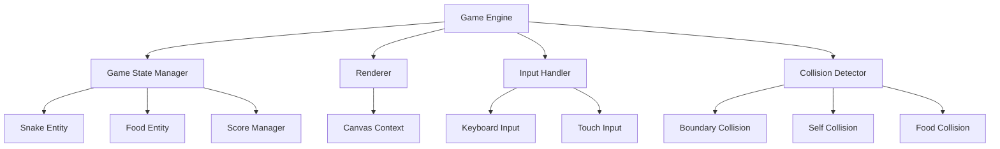

### Component Architecture

#### 1. Game Engine
The main game loop responsible for:
- Initializing the game
- Managing the game state transitions
- Coordinating updates between components
- Controlling frame rate (60 FPS)

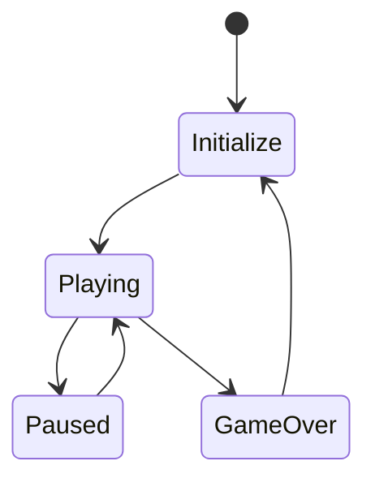

#### 2. Snake Entity
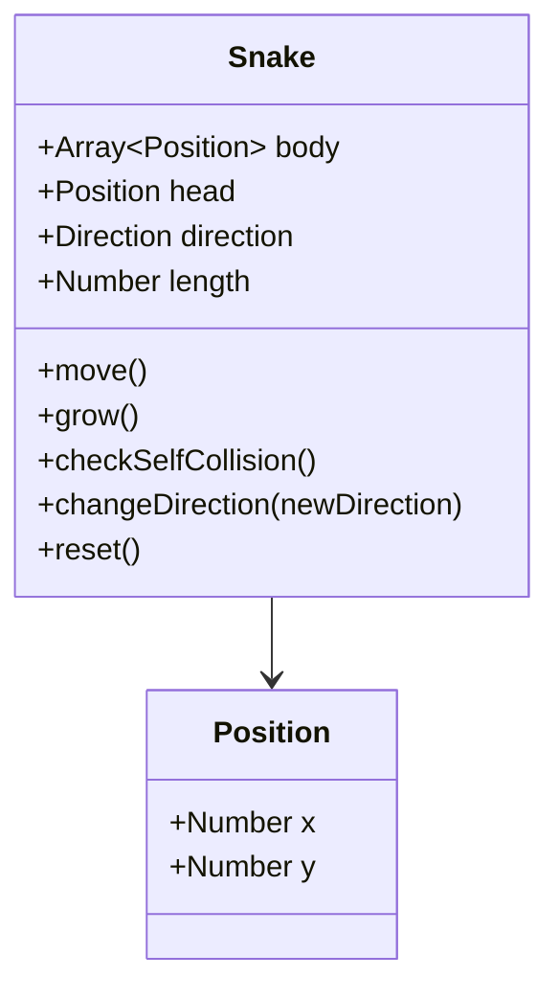

#### 3. Food Entity
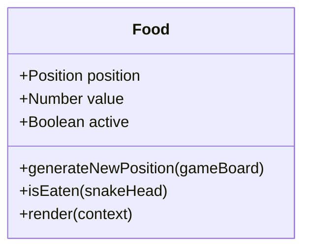

#### 4. Game Board
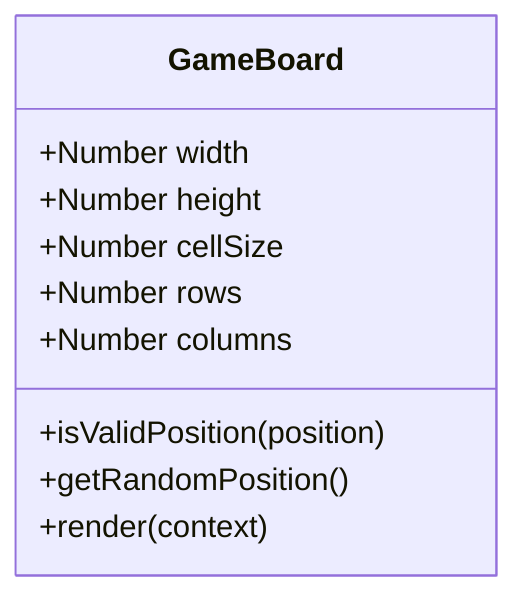

## Game Logic & Data Flow

### Game State Management

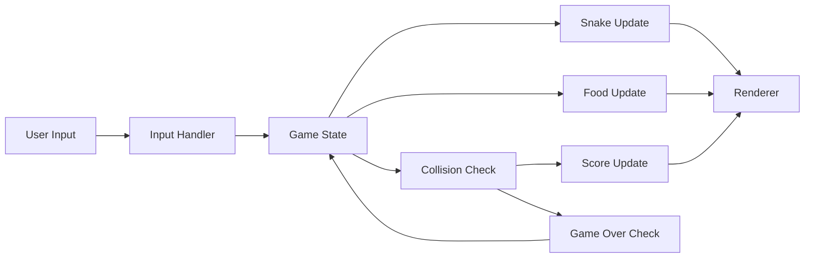

### Core Game Loop

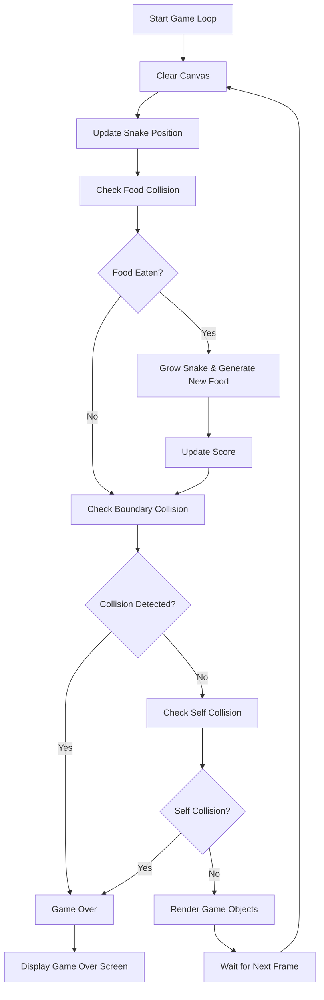

### Movement System

| Direction | Key | Delta X | Delta Y |
|-----------|-----|---------|---------|
| Up        | ↑   | 0       | -1      |
| Down      | ↓   | 0       | 1       |
| Left      | ←   | -1      | 0       |
| Right     | →   | 1       | 0       |

### Collision Detection

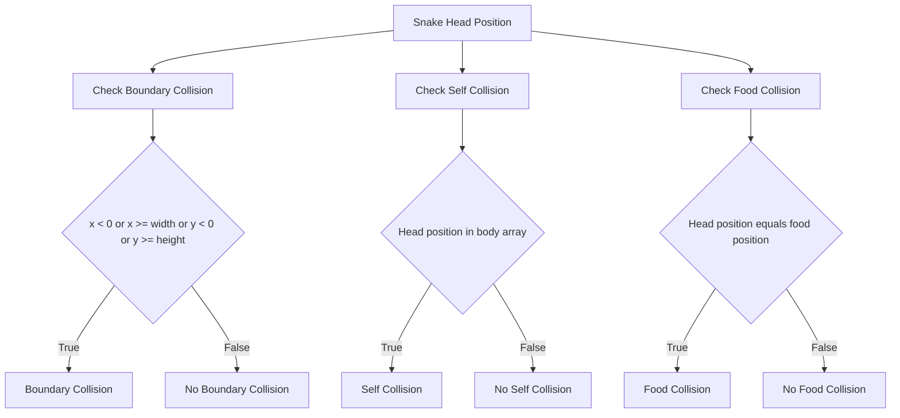

## Styling Strategy

### CSS Architecture

```
styles/
├── base.css          # Reset and base styles
├── layout.css        # Game container and layout
├── components.css    # UI components (buttons, score)
└── responsive.css    # Mobile and tablet styles
```

### Design System

#### Color Palette
```css
:root {
  --game-bg: #1a1a2e;
  --board-bg: #16213e;
  --snake-color: #0f3460;
  --snake-head: #e94560;
  --food-color: #f39c12;
  --text-color: #ffffff;
  --border-color: #2c2c54;
}
```

#### Typography Scale
- Game Title: 2.5rem (40px)
- Score Display: 1.5rem (24px)
- UI Text: 1rem (16px)
- Small Text: 0.875rem (14px)

#### Responsive Breakpoints
```css
/* Mobile */
@media (max-width: 768px) {
  .game-container {
    width: 90vw;
    height: 60vh;
  }
}

/* Tablet */
@media (min-width: 769px) and (max-width: 1024px) {
  .game-container {
    width: 70vw;
    height: 70vh;
  }
}

/* Desktop */
@media (min-width: 1025px) {
  .game-container {
    width: 600px;
    height: 600px;
  }
}
```

## Input System

### Keyboard Controls
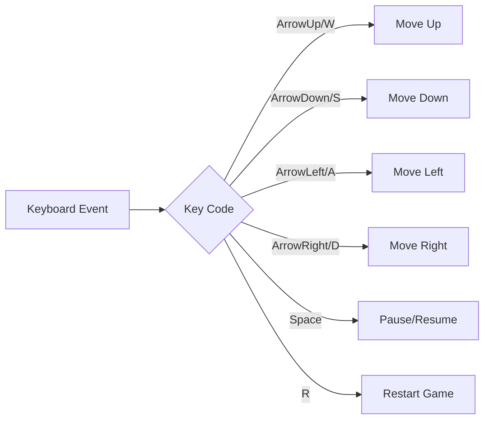

### Touch Controls (Mobile)
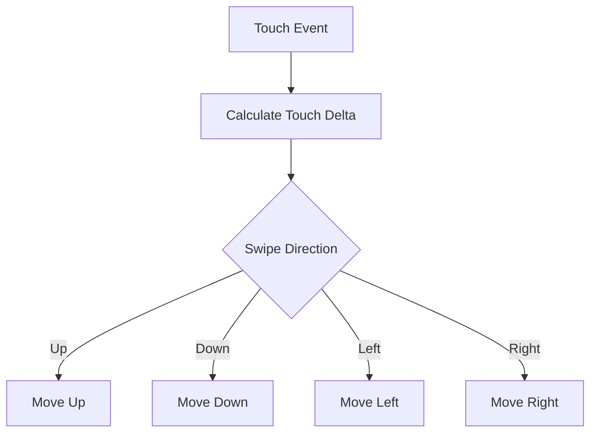

### Input Validation
- Prevent reverse direction (snake can't move directly backwards)
- Debounce rapid key presses
- Queue input commands during frame processing

## Game Configuration

### Settings Object
```javascript
const gameConfig = {
  board: {
    width: 600,
    height: 600,
    cellSize: 20,
    backgroundColor: '#16213e'
  },
  snake: {
    initialLength: 3,
    color: '#0f3460',
    headColor: '#e94560',
    speed: 150 // milliseconds per move
  },
  food: {
    color: '#f39c12',
    size: 18,
    points: 10
  },
  game: {
    fps: 60,
    enableSounds: true,
    highScoreKey: 'snakeHighScore'
  }
}
```

### Difficulty Levels
| Level | Speed (ms) | Description |
|-------|------------|-------------|
| Easy  | 200        | Slow movement for beginners |
| Medium| 150        | Standard game speed |
| Hard  | 100        | Fast-paced gameplay |
| Expert| 75         | Very challenging speed |

## File Structure

```
snake-game/
├── index.html                 # Main HTML file
├── styles/
│   ├── main.css              # Combined styles
│   └── responsive.css        # Mobile styles
├── scripts/
│   ├── game.js               # Main game engine
│   ├── snake.js              # Snake entity
│   ├── food.js               # Food entity
│   ├── input.js              # Input handling
│   ├── renderer.js           # Canvas rendering
│   ├── collision.js          # Collision detection
│   └── utils.js              # Utility functions
└── README.md                 # Project documentation
```

## Testing Strategy

### Unit Testing Approach
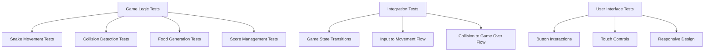

### Test Cases

#### Snake Movement Tests
- Snake moves in correct direction
- Snake head position updates correctly
- Snake body follows head movement
- Snake cannot reverse direction immediately

#### Collision Detection Tests
- Boundary collision detection
- Self-collision detection
- Food collision detection
- Collision detection accuracy at edge cases

#### Game State Tests
- Game initialization
- Pause/resume functionality
- Game over conditions
- Score calculation accuracy

#### Input Handling Tests
- Keyboard input responsiveness
- Touch gesture recognition
- Input queuing during rapid presses
- Invalid input rejection

### Browser Testing Matrix
| Browser | Desktop | Mobile | Tablet |
|---------|---------|--------|--------|
| Chrome  | ✓       | ✓      | ✓      |
| Firefox | ✓       | ✓      | ✓      |
| Safari  | ✓       | ✓      | ✓      |
| Edge    | ✓       | -      | ✓      |

## Performance Considerations

### Optimization Strategies
- **Canvas Optimization**: Only redraw changed regions when possible
- **Memory Management**: Reuse objects instead of creating new instances
- **Frame Rate Control**: Maintain consistent 60 FPS
- **Mobile Performance**: Reduce canvas resolution on low-end devices

### Performance Metrics
- Target: 60 FPS on desktop
- Target: 30 FPS minimum on mobile
- Memory usage should not exceed 50MB
- Initial load time under 2 seconds